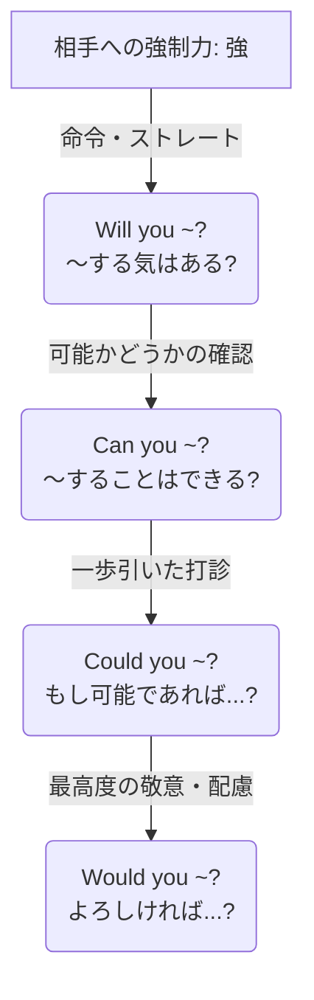

# 依頼・お願いの強弱関係のまとめ

相手に何かを頼むときの表現は、相手への強制力の強さ（丁寧さの度合い）によって明確にレベル分けされる。

---

## 1. 依頼・お願いの強さイメージ図

上に行くほど相手へのプレッシャーが強く（カジュアル）、下に行くほどプレッシャーが弱い（丁寧）表現となる。

---

## 2. 依頼・お願いの強弱比較表

否定文や疑問文のルールと同様に、どの言葉を主語の前に出すかで丁寧さが変わる。

| レベル | 表現形式 | 丁寧さ | 心理的なアプローチ | 例文 |
| :--- | :--- | :--- | :--- | :--- |
| **1** | **Will you ~?** | ★★☆☆☆  （カジュアル） | **「〜する意志はあるか」** とストレートに問いかける。 親しい間柄での頼み事。 | **Will you** open the door? （ドアを開けてくれる？） |
| **2** | **Can you ~?** | ★★★☆☆  （一般的） | **「〜することは可能か」** と能力や状況を尋ねる。 日常会話で最もよく使われる。 | **Can you** open the door? （ドアを開けられる？） |
| **3** | **Could you ~?** | ★★★★☆  （丁寧） | **「仮にできるとしたら…」** と一歩引いて打診する。 canを過去形にして、現実と距離を置く。 | **Could you** open the door? （ドアを開けていただくことは可能ですか？） |
| **4** | **Would you ~?** | ★★★★★  （極めて丁寧） | **「もしよろしければ…」** と相手の意向を最優先する。 willを過去形にして、強制力を完全になくす。 | **Would you** open the door? （ドアを開けていただけますでしょうか？） |

---

## 3. 瞬間的に使い分けるための3つのポイント

1. **過去形（would, could）は「心理的なお辞儀」**
   * お願いの際、あえて過去形にすることで「今すぐやれ」という現実の圧迫感から一歩退く。
   * 相手に「断る余地（逃げ道）」を心理的に与えるため、結果として丁寧な表現になる。
2. **`Could you` と `Would you` の違い**
   * **Could you**：相手に「物理的・状況的に可能か」を配慮して頼む。（例：英語が話せるか、時間が取れるかなど）
   * **Would you**：相手に「親切心からそうする気があるか」を配慮して頼む。
3. **さらに丁寧にしたいときは `mind` を使う**
   * `Would you mind opening the door?`（ドアを開けていただいてもご迷惑ではないですか？）のように、`mind`（気にする）を使うと最もマイルドでフォーマルなお願いになる。
