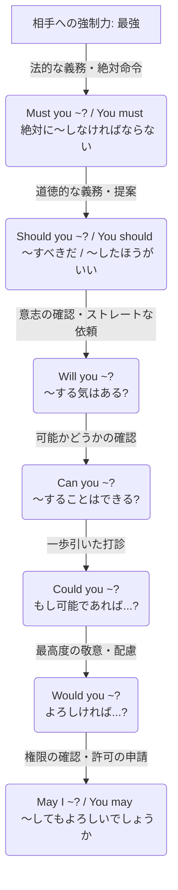

# 依頼・許可・義務の強弱関係のまとめ

相手に何かを頼む、許可する、あるいは指示するときの表現は、相手への強制力の強さ（丁寧さの度合い）によって明確にレベル分けされる。

---

## 1. 相手への強制力・心理的プレッシャーのイメージ図

上に行くほど相手へのプレッシャーが強く（強制・命令）、下に行くほどプレッシャーが弱い（提案・丁寧な依頼）表現となる。

---

## 2. 強弱比較表

主語が `You`（あなたへの指示・義務）か `I`（私が〜してよいかの許可）かによって視点が変わるが、言葉自体が持つ「強制力・心理的プレッシャー」のレベルで並べている。

| レベル | 表現形式 | 強制力 / 丁寧さ | 心理的なアプローチ | 例文 |
| :--- | :--- | :--- | :--- | :--- |
| **MAX** | **Must** | ★★★★★  （絶対的強制） | **「これ以外の選択肢は許さない」** という強い義務・命令。 逆らえない規則や、強い禁止（must not）を伴う。 | **You must** check in before 10 AM. （午前10時までにチェックインしなければならない。） |
| **5** | **Should** | ★★★★☆  （義務・助言） | **「それが当然の義務、または最善の道だ」** と促す。 mustほどの強制力はないが、常識や道徳に基づく。 | **You should** wear a seatbelt. （シートベルトを着用すべきです。） |
| **4** | **Will you ~?** | ★★☆☆☆  （カジュアル依頼） | **「〜する意志はあるか」** とストレートに問いかける。 親しい間柄での頼み事。 | **Will you** open the door? （ドアを開けてくれる？） |
| **3** | **Can you ~?** | ★★★☆☆  （一般的依頼） | **「〜することは可能か」** と能力や状況を尋ねる。 日常会話で最もよく使われる。 | **Can you** open the door? （ドアを開けられる？） |
| **2** | **Could you ~?** | ★★★★☆  （丁寧な依頼） | **「仮にできるとしたら…」** と一歩引いて打診する。 canを過去形にして、現実と距離を置く。 | **Could you** open the door? （ドアを開けていただくことは可能ですか？） |
| **1** | **Would you ~?** | ★★★★★  （極めて丁寧） | **「もしよろしければ…」** と相手の意向を最優先する。 willを過去形にして、強制力を完全になくす。 | **Would you** open the door? （ドアを開けていただけますでしょうか？） |
| **MIN** | **May (I) ~?** | ★★★★★  （格式高い許可） | **「お許しをいただけますか」** と権威に対して一歩下がる。 相手の決定権（許可を与える権利）を全面的に認める。 | **May I** ask a question? （質問をさせていただいてもよろしいでしょうか？） |

---

## 3. 瞬間的に使い分けるためのポイント

### 1. 過去形（would, could）は「心理的なお辞儀」
* お願いの際、あえて過去形にすることで「今すぐやれ」という現実の圧迫感から一歩退く。
* 相手に「断る余地（逃げ道）」を心理的に与えるため、結果として丁寧な表現になる。

### 2. `Could you` と `Would you` の違い
* **Could you**：相手に「物理的・状況的に可能か」を配慮して頼む。（例：英語が話せるか、時間が取れるかなど）
* **Would you**：相手に「親切心からそうする気があるか」を配慮して頼む。

### 3. `Must` は「逃げ道ゼロ」の絶対ルール
* 相手に選択の余地を一切与えない。
* 法律・規則の掲示などで使われるため、日常の対等な会話で乱用すると高圧的に聞こえる。

### 4. `Should` は「そうするのが正しい」という正論
* 「絶対にしろ」ではないが、「常識的に考えて、普通はこうするよね」という心理的プレッシャーを与える。
* アドバイス（〜したほうがいいよ）としても使われるが、少し上から目線になることがある。

### 5. `May` は「上への許可申請」と「上からの許可付与」
* `May I ~?` は最もフォーマルな許可申請。
* 逆に、自分が相手に対して `You may ~`（〜してよい）と言うと、「私があなたに許可を与えます」という特権的なニュアンス（上から目線）になる。

### 6. さらに丁寧にしたいときは `mind` を使う
* `Would you mind opening the door?`（ドアを開けていただいてもご迷惑ではないですか？）のように、`mind`（気にする）を使うと最もマイルドでフォーマルなお願いになる。
