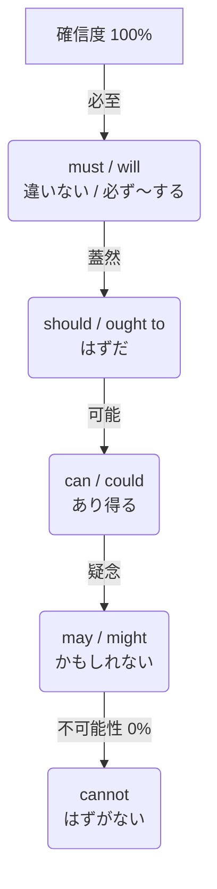
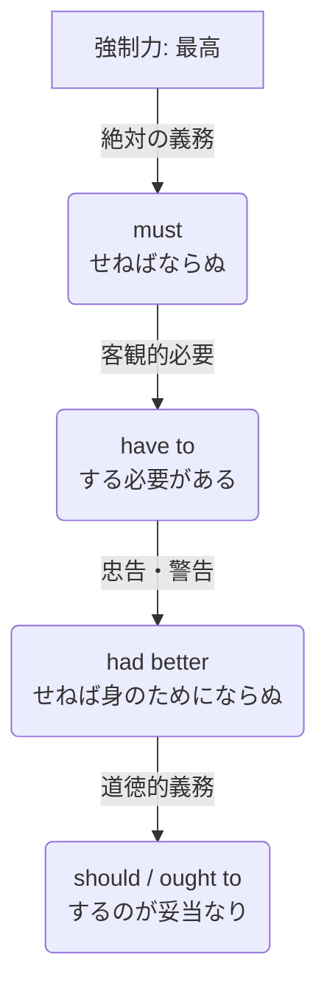

# 助動詞の強弱関係の要略

助動詞は、話し手の心のなかの「確信の度合い」や「要求の厳しさ」によって、その強弱が明確に序列化される。

---

## 1. 確信・推量の強さ（〜に違いない 〜かもしれない）

事実に対する話し手の確信度を表す。100%（確実）から 0%（否定的な確信）までの階層である。

### 確信度の比較表

| 順位 | 助動詞 | 確信の度合い | 文語的ニュアンス | 例文 |
| :--- | :--- | :--- | :--- | :--- |
| **1** | **must** / **will** | 90% 〜 100% | **〜に相違なし / 必せむ** 間違いなくそうである。 | The bird **must** escape. （鳥は逃げるに相違なし） |
| **2** | **should** / **ought to** | 80% 程度 | **〜なるべし / 道理なり** 当然そうなるはずである。 | The bird **should** escape. （鳥は逃ぐべきはずなり） |
| **3** | **can** / **could** | 50% 〜 60% | **〜の可能性あり** 理論上、起こり得る。 | It **can** happen. （それは起こり得ることなり） |
| **4** | **may** | 50% 程度 | **〜かも知れず** 半々の確率である。 | The bird **may** escape. （鳥は逃ぐかも知れず） |
| **5** | **might** | 30% 〜 40% | **ひょっとすると〜せむ** mayよりさらに控えめ。 | The bird **might** escape. （ひょっとすると逃ぐやも知れず） |
| **最下位** | **cannot** | 0%（否定） | **〜なる道理なし** 絶対にあり得ない。 | The bird **cannot** escape. （鳥の逃ぐる道理なし） |

---

## 2. 義務・強制の強さ（〜しなければならない 〜すべき）

相手に行動を促す際の、命令や要求の強制力を表す。

### 強制力の比較表

| 順位 | 助動詞 | 強制の度合い | 文語的ニュアンス | 例文 |
| :--- | :--- | :--- | :--- | :--- |
| **1** | **must** | **絶対・強制** | **〜せねばならぬ** 義務。拒否権なし。 | You **must** go. （汝、行くべし。拒否は許さず） |
| **2** | **have to** | **必要性（客観）** | **〜するを要す** 規則や状況により不可避。 | I **have to** go. （行く必要性に迫られたり） |
| **3** | **had better** | **威嚇・強い忠告** | **〜するが上策なり** せねば実害を被る。 | You **had better** go. （行かねば禍に遭わむ） |
| **4** | **should** / **ought to** | **勧告・道理** | **〜するのが正道なり** 道徳的・一般的な推奨。 | You **should** go. （行くのが良き選択なり） |

---

## 3. 瞬間判断の要点

1. **過去形（could, might, should）は「弱気」の証拠**
   * 元の形（can, may, will）よりも一歩引くため、**確信度は下がり、丁寧度は上がる。**
2. **had better は「提案」ではなく「脅迫」に近い**
   * 優しくアドバイスする際は `should` を選ぶべきであり、`had better` は「〜しないと大変なことになる」という強い警告となる。
3. **must の否定（must not）は「絶対禁止」となる**
   * 行為そのものを完全に封じる最高強度の禁止命令となる。
