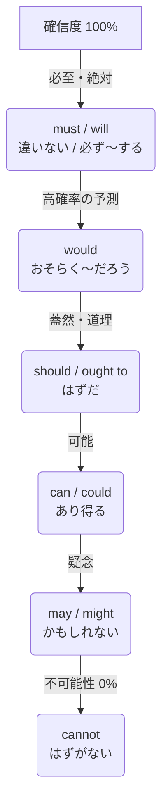
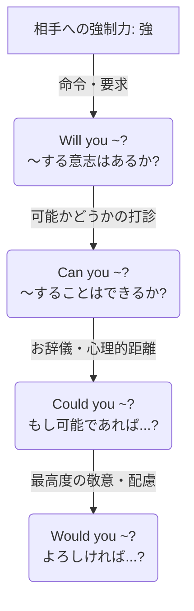

# 助動詞の強弱関係の要略

助動詞は、話し手の心のなかの「確信の度合い」「要求の厳しさ」、および相手への「依頼の丁寧さ（強制力の弱さ）」によって、その強弱が明確に序列化される。

---

## 1. 確信・推量の強さ（〜に違いない 〜かもしれない）

事実に対する話し手の確信度を表す。100%（確実）から 0%（否定的な確信）までの階層である。

### 確信度の比較表

| 順位 | 助動詞 | 確信の度合い | 文語的ニュアンス | 例文 |
| :--- | :--- | :--- | :--- | :--- |
| **1** | **must** / **will** | 90% 〜 100% | **〜に相違なし / 必せむ** 間違いなくそうである / 必ずそうなる。 | The bird **must** escape. （鳥は逃げるに相違なし） |
| **2** | **would** | 80% 〜 90% | **おそらく〜ならむ** willの過去形。想像上の高い確信。 | The bird **would** escape. （鳥はおそらく逃げ去らむ） |
| **3** | **should** / **ought to** | 80% 程度 | **〜なるべし / 道理なり** 当然そうなるはずである。 | The bird **should** escape. （鳥は逃ぐべきはずなり） |
| **4** | **can** / **could** | 50% 〜 60% | **〜の可能性あり** 理論上、起こり得る。 | It **can** happen. （それは起こり得ることなり） |
| **5** | **may** | 50% 程度 | **〜かも知れず** 半々の確率である。 | The bird **may** escape. （鳥は逃ぐかも知れず） |
| **6** | **might** | 30% 〜 40% | **ひょっとすると〜せむ** mayよりさらに控えめ。 | The bird **might** escape. （ひょっとすると逃ぐやも知れず） |
| **最下位** | **cannot** | 0%（否定） | **〜なる道理なし** 絶対にあり得ない。 | The bird **cannot** escape. （鳥の逃ぐる道理なし） |

---

## 2. 依頼・お願いの強さ（〜してくれませんか 〜していただけますか）

相手に何かを頼む際、命令に近い「強気な要求」から、断る余地を残した「丁寧なお願い」までの階層である。

### 依頼・お願いの比較表

| 順位 | 表現形式 | 丁寧さのレベル | 心理的アプローチ | 例文 |
| :--- | :--- | :--- | :--- | :--- |
| **1** | **Will you ~?** | ★★☆☆☆  （カジュアル） | **「〜する意志はあるか」** とストレートに問う。 親しい間柄での頼み事。 | **Will you** open the door? （扉を開けてくれぬか） |
| **2** | **Can you ~?** | ★★★☆☆  （一般的） | **「〜することは可能か」** と能力や状況を尋ねる。 日常で最も多用される。 | **Can you** open the door? （扉を開けられるか） |
| **3** | **Could you ~?** | ★★★★☆  （丁寧） | **「仮にできるとしたら…」** と一歩引いて打診する。 canを過去形にして現実と距離を置く。 | **Could you** open the door? （扉を開けて頂くことは可能か） |
| **4** | **Would you ~?** | ★★★★★  （極めて丁寧） | **「もしよろしければ…」** と相手の意向を最優先する。 willを過去形にして強制力を完全に消す。 | **Would you** open the door? （扉を開けて頂けまいか） |

---

## 3. 義務・強制・意志の強さ（〜しなければならない 〜するつもりだ）

相手に行動を促す際の「強制力」および、自身・主語の持つ「拒絶・意志の強さ」を表す。

### 強制力・主語の意志の比較表

| 順位 | 助動詞 | 性質 | 文語的ニュアンス | 例文 |
| :--- | :--- | :--- | :--- | :--- |
| **1** | **must** / **won't** | **絶対・強制・拒絶** | **〜せねばならぬ / 頑なに拒む** 最高強度の命令、または強い拒絶。 | My dog **won't** eat carrots. （犬、頑なに人参を拒む） |
| **2** | **have to** / **will** | **必要性 / 強い意志** | **〜するを要す / 決意せり** 客観的な不可避、または明確な未来への意志。 | I **will** escape. （我、必ずや逃げ出さむ） |
| **3** | **had better** / **would** | **威嚇 / 過去の固執** | **〜するが上策 / どうしても〜した** 不利益の回避、または過去の執念深い行動。 | The door **would** not open. （扉、どうしても開かざりき） |
| **4** | **should** / **ought to** | **勧告・道理** | **〜するのが正道なり** 道徳的・一般的な推奨。 | You **should** go. （行くのが良き選択なり） |

---

## 4. 瞬間判断の要点

1. **過去形（would, could）は「心理的なお辞儀」**
   * お願いの際、あえて過去形にすることで「今すぐイエスかノーか答えろ」という現実の圧迫感から一歩退く。
   * 相手に「断る余地（逃げ道）」を心理的に与えるため、結果として丁寧な表現となる。
2. **`Could you` と `Would you` の違い**
   * **Could you**：相手に「物理的・状況的に可能か」を配慮して頼む。（例：英語が話せるか、時間が取れるかなど）
   * **Would you**：相手に「親切心からそうする気があるか」を配慮して頼む。
3. **`had better` は「提案」ではなく「脅迫」に近い**
   * 優しくアドバイスする際は `should` を選ぶべきであり、`had better` は「〜しないと大変なことになる」という強い警告となる。
