# 5文型を瞬間的に判断するためのまとめ

英語のすべての文は5つのパターンのいずれかに分類される。
長い文であっても、**「修飾語（前置詞＋名詞、副詞など）」を無視して「動詞（V）の後ろ」を見る**だけで、瞬間的に文型を判断できる。

---

## 1. 瞬間判断のための2ステップ

文型を瞬時に見分けるには、以下の2つのステップを頭の中で行う。

### ステップ①：修飾語（飾り）を消す
* `in the room`, `at 8:00`, `yesterday`, `beautifully` などの**場所・時間・様子を表す言葉**をすべて隠す（これらは文型に影響しない修飾語 `M`）。
* 残った「主語（S）＋ 動詞（V）＋ 後ろの単語」だけで勝負する。

### ステップ②：「動詞の後ろ」の関係性を見る
動詞の後ろにある単語同士を比較し、**「＝（イコール）が成り立つか、成り立たないか」**だけで文型が確定する。

---

## 2. 5文型の瞬間見分けマトリクス

```mermaid
graph TD
    A[動詞の後ろに何がある?] -->|何も残らない / 飾りだけ| B(第1文型: S V)
    A -->|名詞/形容詞が1つ| C{S と 後ろの単語 は?}
    C -->|S ＝ 後ろの単語| D(第2文型: S V C)
    C -->|S ＝/＝ 後ろの単語| E(第3文型: S V O)
    A -->|名詞が2つ並ぶ| F{後ろの単語同士 は?}
    F -->|名詞1 ＝/＝ 名詞2| G(第4文型: S V O1 O2)
    F -->|名詞1 ＝ 名詞2 / 形容詞| H(第5文型: S V O C)
```

---

## 3. 各文型の見分け方と瞬間判定ルール

### 【第1文型】 S ＋ V （主語 ＋ 動詞）
* **瞬間判定**：動詞の後ろに**「何も残らない」**、または**「場所・時間の飾り（M）」**しかない。
* **日本語訳**：Sが「いる」「ある」「移動する」
* **例文**：
  * `The bus arrived.` （バスが到着した。＝後ろに何もない）
  * `The bus arrived [at 8:00].` （バスは8時に着いた。＝at 8:00は時間なので飾り）

### 【第2文型】 S ＋ V ＋ C （主語 ＋ 動詞 ＋ 補語）
* **瞬間判定**：動詞の後ろの単語（C）を見たとき、**【 S ＝ C 】**が成り立つ。
* **日本語訳**：SはCだ、Cになる、Cに見える
* **例文**：
  * `He is a teacher.` （彼 ＝ 先生）
  * `The bus was late.` （バス ＝ 遅れた状態）

### 【第3文型】 S ＋ V ＋ O （主語 ＋ 動詞 ＋ 目的語）
* **瞬間判定**：動詞の後ろの単語（O）を見たとき、**【 S ≠ O 】**（イコールにならない）。
* **日本語訳**：SがOを（に）〜する
* **例文**：
  * `I use the bus.` （私 ≠ バス。「私はバスを使う」）
  * `He opened the door.` （彼 ≠ ドア。「彼はドアを開けた」）

### 【第4文型】 S ＋ V ＋ O1 ＋ O2 （主語 ＋ 動詞 ＋ 目的語1 ＋ 目的語2）
* **瞬間判定**：動詞の後ろに名詞が2つ並び、**【 後ろの名詞同士が ≠ 】**（イコールにならない）。
* **日本語訳**：Sが「人（O1）」に「モノ（O2）」を**与える**（give, buy, showなど）
* **例文**：
  * `He gave me a ticket.`
    * 判定：`me`（私）≠ `a ticket`（チケット）。よって第4文型。「私にチケットをくれた」

### 【第5文型】 S ＋ V ＋ O ＋ C （主語 ＋ 動詞 ＋ 目的語 ＋ 補語）
* **瞬間判定**：動詞の後ろに2つ単語が並び、**【 後ろの単語同士が ＝ 】**（ネコ＝タマ の関係）になる。
* **日本語訳**：Sのせいで「O ＝ C」という状態になる・わかる（make, call, keepなど）
* **例文**：
  * `We call the cat Tama.`
    * 判定：`the cat`（その猫）＝ `Tama`（タマ）。よって第5文型。「私たちはその猫をタマと呼ぶ」
  * `The traffic jam made the bus late.`
    * 判定：`the bus`（バス）＝ `late`（遅れた状態）。「渋滞がバスを遅れさせた」

---

## 4. 瞬間判断を狂わせる「2大ひっかけ」の対策

### ① look や smell などの動詞（第2文型）
* `He looks happy.` （彼 ＝ 幸せそう）
* 「〜を見る」と訳してしまうと第3文型と勘違いしやすいですが、`He ＝ happy` が成り立つので一瞬で**第2文型（SVC）**だと見抜けます。

### ② 前置詞がつくと「飾り（M）」に化ける
* `He gave a ticket to me.`
  * 動詞の後ろに `a ticket` と `to me` があります。しかし、`to` は前置詞なので `[to me]` はただの飾り（M）になり、文型から消えます。
  * 残るのは `He gave a ticket`（S V O）なので、これは**第3文型**になります。（※第4文型と意味は同じですが、文型は変わります）
