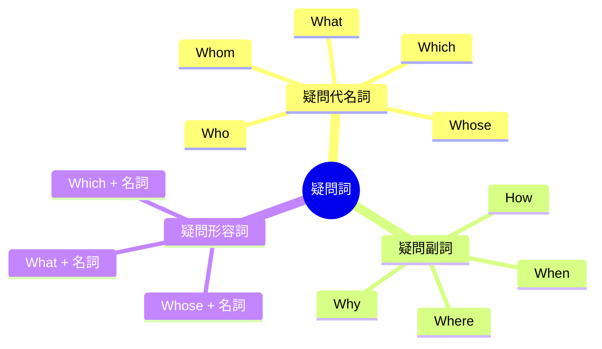
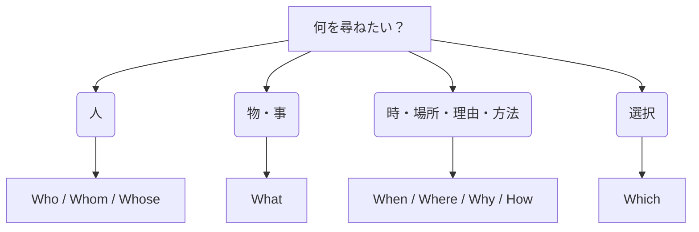

英語の疑問詞（Wh-words）の種類、用法、および瞬間的判断法をまとめる。

---

## 疑問詞の全体像（マインドマップ）

---

## 疑問詞の種類と用法一覧

### 1. 疑問代名詞（名詞の代わり）
文の中で主語、目的語、補語になる。後ろの文は**不完全な文**（名詞が1つ欠けた状態）になる。

| 疑問詞 | 意味 | 対象 | 例文 |
| :--- | :--- | :--- | :--- |
| **Who** | 誰が、誰に | 人（主格・目的格） | **Who** broke this window? (誰が壊した？) |
| **Whom** | 誰を、誰に | 人（目的格・堅い表現）| **Whom** did you meet? (誰に会った？) |
| **Whose** | 誰のもの | 所有者 | **Whose** is this umbrella? (これ誰の？) |
| **What** | 何が、何を | 物・事・職業 | **What** happened? (何が起きた？) |
| **Which** | どちらが、どちらを | 選択（限定された中から）| **Which** do you prefer? (どっちが好き？) |

### 2. 疑問副詞（副詞の代わり）
時、場所、理由、方法を表す。後ろの文は**完全な文**（名詞の欠けがない状態）になる。

| 疑問詞 | 意味 | 対象 | 例文 |
| :--- | :--- | :--- | :--- |
| **When** | いつ | 時 | **When** does the train leave? (いつ出発する？) |
| **Where** | どこで、どこに | 場所 | **Where** do you live? (どこに住んでる？) |
| **Why** | なぜ | 理由 | **Why** were you late? (なぜ遅れた？) |
| **How** | どうやって、どんな | 方法・状態 | **How** did you fix it? (どうやって直した？) |

### 3. 疑問形容詞（名詞を修飾）
直後に名詞を伴い、ひとかたまりの疑問詞として扱う。

| 構成 | 意味 | 例文 |
| :--- | :--- | :--- |
| **What + 名詞** | 何の[名詞] | **What color** do you like? (何色が好き？) |
| **Which + 名詞** | どちらの[名詞] | **Which bus** goes to the station? (どっちのバス？) |
| **Whose + 名詞** | 誰の[名詞] | **Whose shoes** are these? (誰の靴？) |

### 4. Howの拡張用法（How + 形容詞/副詞）
程度を尋ねる。

*   **How many + 可算名詞の複数形**: 数の多さ（How many books...）
*   **How much + 不可算名詞**: 量・金額（How much money... / How much is it?）
*   **How old**: 年齢（How old are you?）
*   **How long**: 長さ・期間（How long does it take?）
*   **How often**: 頻度（How often do you go?）

---

## 瞬間的に判断・使い分ける方法

会話や読解で迷わないための脳内フロー。

### 1. 「人」か「物」か「状況」かで分ける
思考のスタート地点を絞る。

### 2. 後ろの文の「穴」で見分ける（重要）
空欄（欠落）があるかどうかで代名詞か副詞かを瞬時に見分ける。

*   **後ろが不完全（主語や目的語がない）** → **疑問代名詞**
    *   例：`[   ]` is in the box? → 主語がないから **What**
    *   例：Did you buy `[   ]`? → 目的語がないから **What**
*   **後ろが完全（文が完成している）** → **疑問副詞**
    *   例：You live in Tokyo.（完全な文） → どこ？と聞くなら **Where** do you live?

### 3. 「限定」があるかないか
「何」と「どちら」の迷いを無くす。

*   **範囲がない（無限）** → **What**（What sport do you like?）
*   **範囲がある（選択肢が明確）** → **Which**（Which sport do you like, baseball or soccer?）
