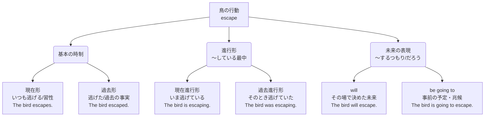

# 英語の基本時制・表現のまとめ

主語を「The bird（その鳥）」、動詞を「escape（逃げる）」に統一し、各時制の文法と例文を比較する。

---

## 1. 時制の全体イメージ図
各時制がどのような意味の広がりを持っているかの全体像。

---

## 2. 文法・例文比較表

### 【基本の時制】現在形・過去形
現在形と過去形は、**一般動詞（escape）自体を変化**させる。否定文や疑問文では、動詞の代わりに時制や人称（単数/複数）の情報を引き受ける **does / did（助動詞）** を補う。

| 時制 | 人称変化（主語） | 肯定文 | 否定文 | 疑問文 |
| :--- | :--- | :--- | :--- | :--- |
| **現在形** （現在の事実・習慣・習性） | **三人称単数** (The bird) | The bird **escapes**. | The bird **does not escape**. | **Does** the bird **escape**? |
| | **複数・その他** (The birds / I) | The birds **escape**. | The birds **do not escape**. | **Do** the birds **escape**? |
| **過去形** （過去の事実・出来事） | **すべて共通** (単数・複数同形) | The bird **escaped**. | The bird **did not escape**. | **Did** the bird **escape**? |

> [!NOTE]
> **do / does / did の文法規則**
> * **do**：現在形で、主語が三人称単数でないときに使う。動詞の「s」はそのまま。
> * **does**：現在形で、主語が三人称単数のときに使う。動詞の「s（またはes）」をdoesが吸収する。
> * **did**：過去形で、主語の人称に関わらず共通して使う。動詞の「過去の形（edなど）」をdidが吸収する。
> * **動詞の原形化**：否定文・疑問文では、does / did がすでに時制や人称の役割を果たしているため、後ろに続く `escapes` や `escaped` はすべて元の形（**escape：原形**）に戻る。

---

### 【進行形】現在進行形・過去進行形
進行形は **[ am / is / are / was / were ] ＋ [ 動詞のing形 ]** の組み合わせで作る。人称変化や否定・疑問のルールは、すべて **be動詞の規則** に従う。

| 時制 | 人称変化（主語） | 肯定文 | 否定文 | 疑問文 |
| :--- | :--- | :--- | :--- | :--- |
| **現在進行形** （いま〜している） | **三人称単数** (The bird) | The bird **is escaping**. | The bird **is not escaping**. | **Is** the bird **escaping**? |
| | **複数形** (The birds) | The birds **are escaping**. | The birds **are not escaping**. | **Are** the birds **escaping**? |
| **過去進行形** （そのとき〜していた）| **三人称単数** (The bird) | The bird **was escaping**. | The bird **was not escaping**. | **Was** the bird **escaping**? |
| | **複数形** (The birds) | The birds **were escaping**. | The birds **were not escaping**. | **Were** the birds **escaping**? |

> [!NOTE]
> `escaping` の形は主語が変わっても変化しない。手前の **be動詞（is/are/was/were）だけ**が変化する。

---

### 【未来の表現】will と be going to
未来の表現には主に2つのパターンがある。助動詞の **will** を使う形と、進行形に似た **be going to** を使う形である。

| 表現パターン | 人称変化（主語） | 肯定文 | 否定文 | 疑問文 |
| :--- | :--- | :--- | :--- | :--- |
| **will** （〜するだろう / 意志） | **すべて共通** (単数・複数同形) | The bird **will escape**. | The bird **will not escape**. | **Will** the bird **escape**? |
| **be going to** （〜する予定だ / 兆候）| **三人称単数** (The bird) | The bird **is going to escape**. | The bird **is not going to escape**. | **Is** the bird **going to escape**? |
| | **複数形** (The birds) | The birds **are going to escape**. | The birds **are not going to escape**. | **Are** the birds **going to escape**? |

> [!NOTE]
> `will` の後ろは必ず動詞の元の形（**escape**）になる。`be going to` は進行形と同じく、先頭の **be動詞（is/are）だけ**が変化する。
